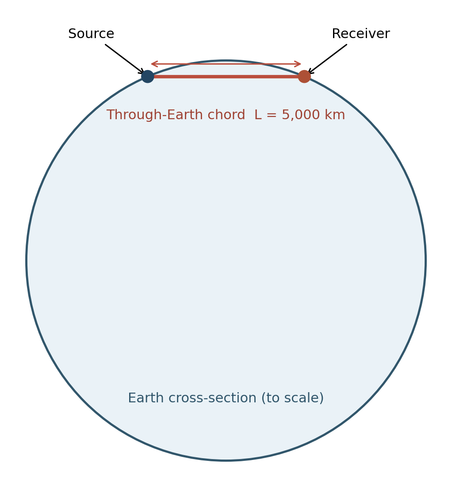
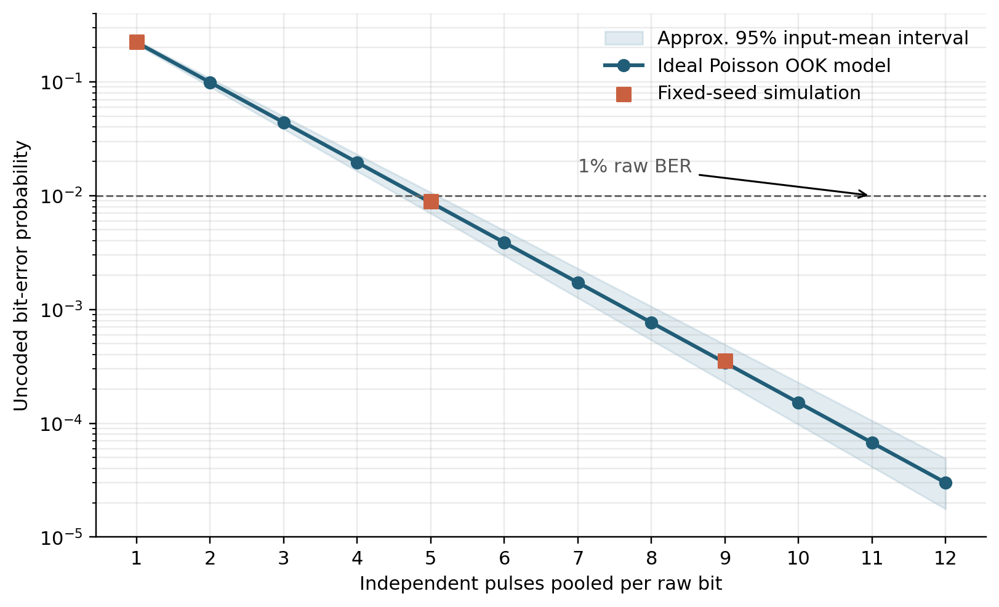
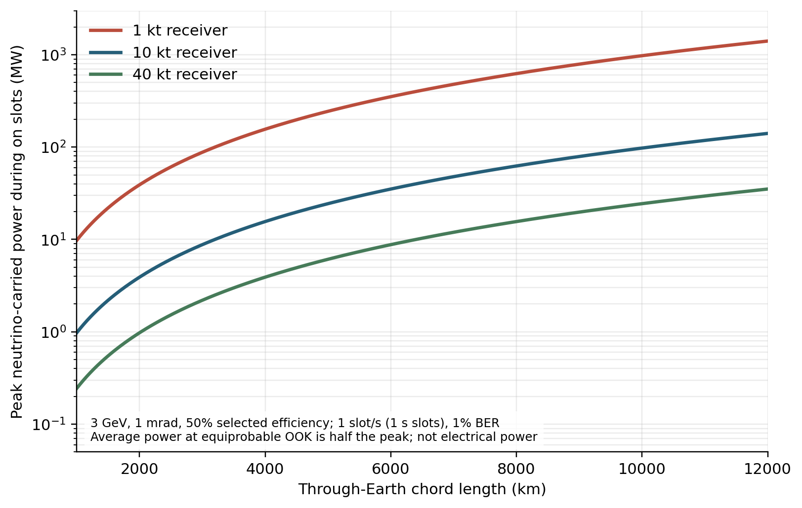
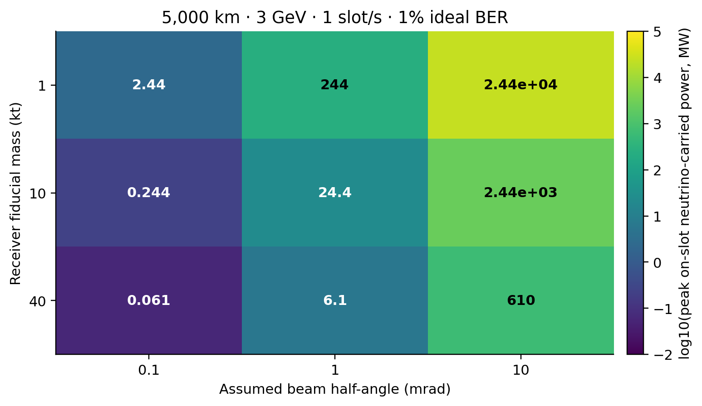
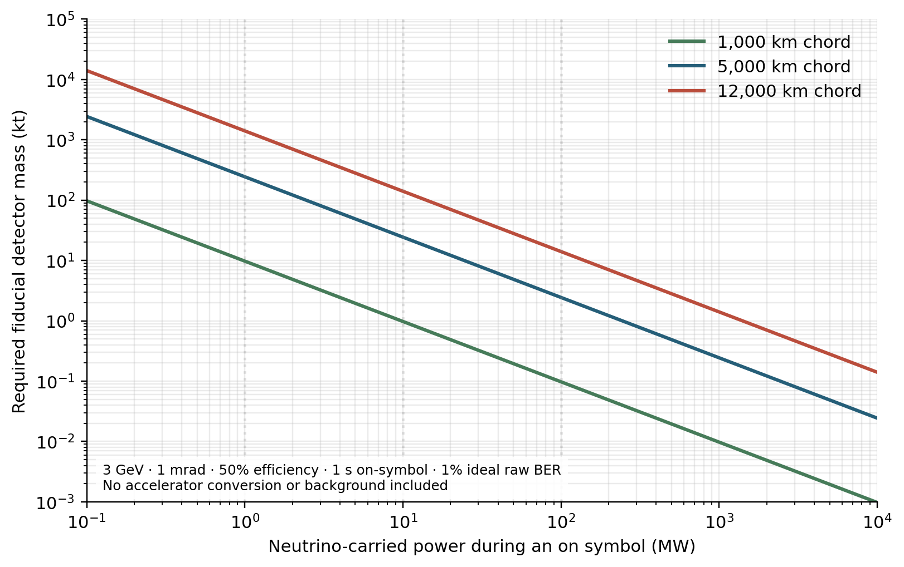
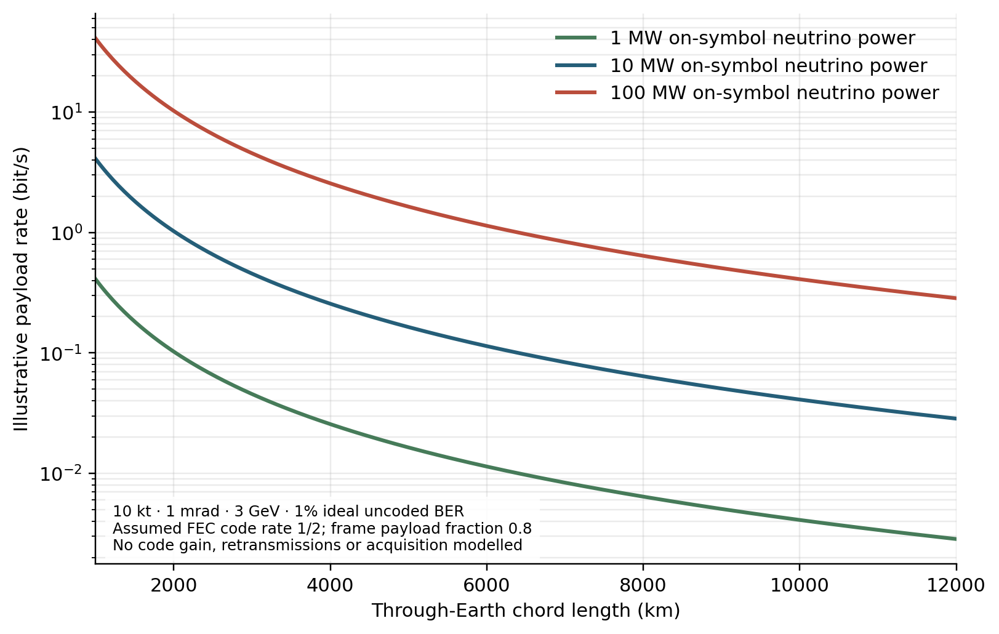
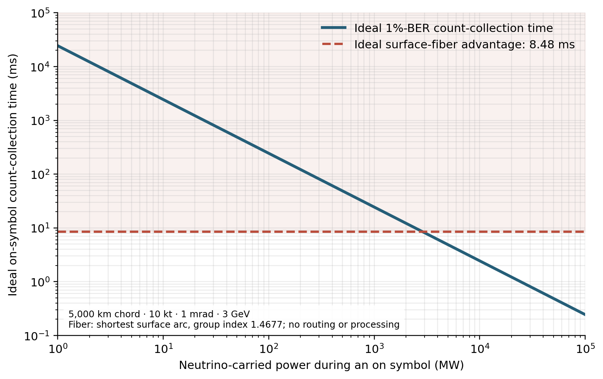

# Direct Neutrino Communication Through the Earth: An Initial Quantitative Feasibility Map

**Sven-Patrik Hallsjö**  
**Working manuscript, version 0.2 — 23 September 2026**

> **Status.** This draft combines a published experimental benchmark with a deliberately simplified sensitivity calculation. It has not established the feasibility of a particular accelerator–detector installation. Values described as “beam power” are energy carried by neutrinos; they are neither proton beam power nor facility electrical power. The source-specific and propagation calculations identified in Section 6 are necessary before submission.

## Abstract

Neutrinos can cross substantial amounts of matter, making a direct communication path through the Earth physically possible. Their small interaction probability, however, transfers the difficulty to the transmitter and receiver. We construct an initial quantitative map of that trade-off. First, we reproduce the uncoded on–off-keying error probability implied by the NuMI–MINERvA communication demonstration, using its reported mean of 0.81 selected signal events per transmitted pulse. Pooling five ideal independent pulses gives a predicted bit-error probability of 0.00871; a seeded 200,000-bit simulation gives 0.00893. Second, we examine an independent, idealized long-baseline model with a monoenergetic 3 GeV beam, specified angular spread, detector mass and event-selection efficiency. For a 10 kt receiver, 1 mrad beam half-angle and 50% efficiency, the neutrino-carried power associated with 1 raw bit s⁻¹ at 1% uncoded bit error is approximately 0.98, 24.4 and 140.5 MW for 1,000, 5,000 and 12,000 km chords, respectively. These are sensitivity results conditional on optimistic assumptions, not predictions for an existing facility. The strongest geometric dependence is on angular spread and distance. At a 5,000 km chord and 1 mrad, the model requires a neutrino-carried-power–detector-mass product of 244 MW·kt for a one-second on symbol; reaching a millisecond symbol with a 10 kt receiver would require 24.4 GW carried by neutrinos. These model results expose a crucial distinction between propagation latency and the time required to collect enough detected events. The remaining determinants include the achievable beam spectrum, flavor evolution, detector response, background, timing and source conversion efficiency. We examine submerged receivers and financial links as conditional applications, without assigning them a demonstrated operating point.

**Keywords:** neutrino communication; through-Earth links; Poisson channel; accelerator beam; detector sensitivity; feasibility.

**Figure 1.** A fixed-source example used to define chord length. The source and receiver lie on the surface; a real installation would require a beamline oriented along the chord.

## 1. Introduction

Communication through rock or across a large terrestrial chord ordinarily requires an indirect route. Neutrino beams offer an unusual direct path because most neutrinos traverse matter without interacting. The same property makes reception difficult: very few transmitted particles generate identifiable events in a finite detector. Consequently, a beam that can be detected statistically need not carry a useful message at an acceptable error rate or cost.

The possibility has passed an experimental proof-of-principle test. Stancil *et al.* transmitted an encoded message using the NuMI beam and MINERvA detector over 1.035 km, including 240 m of earth. They report a decoded rate of 0.1 bit s⁻¹ and a 1% bit error rate [1]. That result establishes a link at its particular source, geometry, detector and decoding protocol; it does not answer whether a regional or global direct link could be operated at a useful rate.

Huber studied a one-way link to a submerged submarine using a high-energy neutrino beam from a muon storage ring [2]. Learned, Pakvasa and Zee examined signalling on galactic scales [3]. A later submarine-navigation proposal addresses position, navigation and timing rather than reliable delivery of an arbitrary message [4]. These studies motivate a clear separation between demonstrated transmission and projections under particular technologies.

This study also follows Hallsjö's analysis of locating nuclear-powered submarines by their emitted antineutrinos [5]. That work treated an uncontrolled, comparatively low-energy reactor source as a detection problem and examined sparse counts, background, geometry and detector deployment. Here the question is different: for a controlled and modulated source, what signal count is needed to decode bits, and how does an idealized source requirement change with baseline, angular spread and receiver size? The detector and interaction expertise documented in Hallsjö's Baby MIND thesis informs the next, detector-specific stage of this work [6]. Reactor-antineutrino event rates or detector assumptions from [5] are not transferred to the high-energy communication example.

Global neutrino telecommunications were already examined quantitatively by Sáenz *et al.* in 1977 [16]. The present novelty therefore cannot be the existence of that idea. Our immediate aim is a transparent *scoping calculation* that connects an explicit error target to detector size and neutrino-carried energy rate, then tests where two proposed applications meet stronger receiver and latency constraints. We report what the stated assumptions imply and identify which missing inputs prevent an engineering conclusion.

## 2. Link definition and communication metric

Consider a stationary source that sends on–off-keyed symbols toward a stationary receiver through a chord of length `L`. In an ideal synchronized slot, an on symbol yields a selected signal count with Poisson mean `s`; an off symbol has no signal. A background count with mean `b` may be present in either slot. Conditional on transmitted symbol `x ∈ {0,1}`, the count model is

`K | x ~ Poisson(b + s x)`.                                                    (1)

For equally probable input symbols, `b = 0`, and a threshold of one observed event, false-positive errors vanish and an on symbol is missed with probability `exp(−s)`. Therefore

`BER_uncoded = ½ exp(−s)`.                                                     (2)

This equation measures uncoded, synchronized *raw* bits. A delivered payload rate must additionally account for symbol slots, synchronization, framing, coding, source duty cycle and any failed frames. An actual background `b > 0` introduces both false-positive and false-negative errors; neither Eq. (2) nor a threshold of one should then be assumed optimal.

We choose a target `BER_uncoded = 0.01`, so the mean signal requirement under the stated ideal conditions is

`s_required = −ln(2 × 0.01) = 3.912 selected events per on symbol`.            (3)

For 1 raw bit s⁻¹ and equal on/off probabilities, the source emits an on pulse in half the symbol slots on average. To avoid ambiguity, the calculation below treats the *on-slot* signal requirement as a continuous per-bit source budget: it effectively specifies the peak beam energy during an on symbol, or a conservative full-duty equivalent at 1 symbol s⁻¹. The **time-averaged transmitted energy for equiprobable data would be half of the tabulated full-duty-equivalent values**, before adding framing and other overhead. This convention must be held fixed when comparing source power. 

## 3. Methods

### 3.1 Published experimental benchmark

Stancil *et al.* report an average of approximately `0.81` selected muon events for a beam-on pulse in the reduced-intensity communication run [1]. Their measurement includes charged-current interactions in upstream rock whose muons enter MINERvA, as well as a smaller in-detector component. Consequently, it is incorrect to turn that count directly into a fiducial-target interaction probability for the detector alone.

For the limited purpose of validating Eq. (2), we assume independent pulses and zero background, and pool `n` pulses for each bit, giving `s = 0.81 n`. We compare the analytical error probability with a fixed-seed simulation of 200,000 equally likely bits for each `n`. A simulated on bit is missed with probability `exp(−0.81n)`; an off bit is always decoded correctly under this model. This is a simulation of the Poisson zero-count event, not a reconstruction of MINERvA data. Stancil *et al.* used a synchronization sequence, convolutional error correction and repeated frames; this study does not reimplement those procedures [1].

### 3.2 Illustrative far-field receiver model

For a separate link sensitivity study, we assume an approximately circular far-field neutrino footprint with characteristic half-angle `θ`. At distance `L`, its area is `A = π(θL)²`. If the footprint is appreciably larger than the receiver and illumination is sufficiently uniform, an approximate selected-event probability per neutrino directed into that footprint is

`p_sel ≃ (M/m_u) σ_CC(E) ε / [π(θL)²]`,                                     (4)

where `M` is fiducial target mass, `m_u` is the atomic mass unit expressed in grams, `σ_CC` is the per-nucleon charged-current cross section and `ε` subsumes trigger and event-selection efficiency. This expression assumes a target small compared with the beam footprint and does not specify a receiver shape. It cannot be extrapolated to an arbitrarily narrow beam or a detector larger than the footprint.

We set `E = 3 GeV`, `σ_CC = 0.67 × 10⁻³⁸(E/GeV) cm²` per nucleon as an approximate illustrative parametrization, `ε = 0.5`, and vary `M = 1, 10, 40 kt`, `θ = 0.1, 1, 10 mrad`, and `L = 1,000, 5,000, 12,000 km`. The cross-section approximation is not a precision calculation at 3 GeV; a subsequent version must use energy-dependent inputs and uncertainties from the Particle Data Group [7]. We assume a single selected flavor at the receiver, no oscillation loss, no absorption, no off-slot background, perfect pointing and timing, and an unconstrained beam of the specified divergence. In particular, a 0.1 mrad beam at 3 GeV is a sensitivity parameter, **not an established accelerator capability**.

The energy carried by 3 GeV neutrinos to deliver `R` raw on-symbol opportunities per second with the required expected count is represented by

`P_ν,full = R × s_required × E / p_sel`.                                       (5)

This is an idealized **full-duty-equivalent neutrino energy rate** for on symbols, in watts when `E` is in joules. With random equally probable OOK symbols, the corresponding time-average is `P_ν,full/2`; real coding and protocol overhead may change the on-symbol fraction. Eq. (5) does not compute the intensity or electrical power required to *produce* and *focus* those neutrinos. For physically achievable sources, total input power will depend on source conversion, energy distribution, duty cycle and beam optics.

The numerical calculation uses `m_u = 1.66053906660 × 10⁻²⁴ g` and `1 GeV = 1.602176634 × 10⁻¹⁰ J`. It is implemented in the accompanying `model.py`, with fixed random seed `20260923`; the scenario grid and benchmark are supplied as CSV files [11].

## 4. Results

### 4.1 Communication benchmark

| Pulses pooled per raw bit | Mean selected on-bit events | Eq. (2) BER | Simulated BER, 200,000 bits |
| ---: | ---: | ---: | ---: |
| 1 | 0.81 | 0.22243 | 0.22318 |
| 5 | 4.05 | 0.00871 | 0.00893 |
| 9 | 7.29 | 0.000341 | 0.000355 |

**Figure 2.** Idealized zero-background, synchronized on–off keying at the published selected-event mean, 0.81 per on-pulse. This is a model check, not a reproduction of the full experimental decoder.

The simulation agrees with the analytical Bernoulli zero-count prediction at the shown precision. Five pulses give approximately 99.1% correct *uncoded synchronized bits* under these assumptions. This is consistent in scale with Stancil *et al.*'s statement that pooling five frames allowed 99% of transmitted bits to be decoded correctly, but frames and pulses are not interchangeable and this table is **not** an independent reproduction of their decoded 0.1 bit s⁻¹ performance [1].

### 4.2 Illustrative long-baseline sensitivity

Table 2 gives the full-duty-equivalent neutrino energy rate calculated from Eqs. (3)–(5), for `R = 1` raw symbol s⁻¹ and `θ = 1 mrad`. All scenarios target 1% uncoded bit error with zero background. Units are MW of neutrino-carried energy **during on-symbol-equivalent operation**, not MW of accelerator electricity.

| Chord length | 1 kt receiver | 10 kt receiver | 40 kt receiver |
| ---: | ---: | ---: | ---: |
| 1,000 km | 9.76 MW | 0.976 MW | 0.244 MW |
| 5,000 km | 244 MW | 24.4 MW | 6.10 MW |
| 12,000 km | 1,405 MW | 140.5 MW | 35.1 MW |

**Figure 3.** Far-field sensitivity under the explicit assumptions of Section 3.2. The logarithmic ordinate shows neutrino-carried energy rate, not accelerator input power.

**Figure 4.** This matrix visualizes nine of the 27 computed cases. The 0.1 mrad column is a mathematical sensitivity test; no source capable of that angular spread at 3 GeV has been demonstrated here.

At fixed target mass and divergence, Eq. (4) implies `P_ν,full ∝ L² θ²/M`. The 10 kt, 5,000 km reference case is 24.4 MW at 1 mrad; setting the hypothetical divergence to 0.1 mrad changes this illustrative value to 0.244 MW, while 10 mrad changes it to 2,440 MW. Across all 27 calculated combinations, the smallest and largest entries are 0.00244 MW and approximately 140,549 MW, respectively. These extremes primarily reveal the leverage and danger of treating beam divergence as an unconstrained parameter. The complete grid is in [11].

**Figure 5.** Inversion of the same idealized model for a one-second on symbol. Each curve is a conditional mass–power trade-off, not a feasible accelerator design.

The model yields a compact operating-point relation. At 1 mrad, 3 GeV and 50% efficiency, for a one-second on symbol and 1% ideal raw BER,

`P_ν,on (MW) × M (kt) = 9.76 × (L/1,000 km)² MW·kt`.                        (6)

More generally, the right-hand side multiplies by `(θ/1 mrad)² × (0.5/ε) × (1 s/τ)` for on-symbol duration `τ`. Equation (6) assumes that the beam footprint is wider than the detector and the other conditions of Section 3.2 hold. It states a **trade-off within one model**, not a minimum cost of any possible communication system.

| Chord | Product for 1 s on symbol | Receiver at 1 MW carried by neutrinos | Receiver at 10 MW | Receiver at 100 MW |
| ---: | ---: | ---: | ---: | ---: |
| 1,000 km | 9.76 MW·kt | 9.76 kt | 0.976 kt | 0.0976 kt |
| 5,000 km | 244 MW·kt | 244 kt | 24.4 kt | 2.44 kt |
| 12,000 km | 1,405 MW·kt | 1,405 kt | 140.5 kt | 14.05 kt |

These values are generated by `tradeoffs.py` and included in `power_detector_tradeoff.csv` [11]. They expose the receiver challenge: a 10 kt detector at 5,000 km requires 24.4 MW carried by the assumed beam during a one-second on symbol; 100 MW carried by neutrinos reduces the model receiver mass to 2.44 kt, still far from a compact installation. Reducing the bit interval by a factor of 1,000 raises the required neutrino-carried power by the same factor at fixed mass. It cannot be compensated by faster neutrino propagation.

**Neutrino energy is distinct from source power.** In this deliberately linear cross-section approximation `σ_CC(E) ∝ E`, the ratio `E/σ_CC(E)` in Eq. (5) cancels when `θ` and `ε` are artificially held fixed. Raising the individual neutrino energy from 3 GeV does **not**, by itself, improve this simplified neutrino-carried-power bound. A physical source changes its energy–angle spectrum and attainable divergence with accelerator design and neutrino energy; interaction cross sections, detector response, Earth propagation and secondary-particle ranges also change. The proton or muon beam energy and wall-plug power are separate quantities. If `η_useful` denotes the total efficiency from facility input to energy carried by neutrinos in the useful beam, the facility input would be `P_input = P_ν/η_useful`, before any other site loads. We have not established `η_useful` for a specified design and therefore cannot give a credible accelerator electrical-power number.

The displayed values are conditional, optimistic estimates. They are **not** a claim that the desired rates are feasible, nor a universal lower bound on all possible neutrino communication systems. A beam energy spectrum, realistic source geometry or another detection channel changes the result; backgrounds, pointing losses, flavor oscillations and synchronization generally increase the requirements of this particular link design.

### 4.3 Raw, coded and compressed throughput

Equation (6) can be inverted into a deliberately normalized *raw symbol rate*, holding 3 GeV, 50% efficiency, 1 mrad and 1% ideal uncoded bit error fixed:

`R_raw ≃ 0.1025 [P_ν,on/MW] [M/kt] (1,000 km/L)² symbol s⁻¹`.             (7)

For another divergence or efficiency, multiply by `(1 mrad/θ)²(ε/0.5)`. In ordinary mass units, `M/kt = (M/kg)/10⁶`. This normalization is meaningful only for the model's **neutrino-carried on-symbol power**, receiver mass and raw Poisson decision. It is not a rate per accelerator MW. Peak on-symbol power must also be distinguished from mean transmitted power: equiprobable on–off signalling uses the beam in approximately half the raw slots, but coding can change that fraction.

To expose the difference between physical rate and useful rate, define a *bookkeeping example* with forward-error-correction (FEC) code rate `r_c = 1/2` and a frame payload fraction `f = 0.8`. Then `R_payload,illustrative = R_raw r_c f = 0.4 R_raw`, before acquisition, retransmission, acknowledgements or decoder failures. No specific code has been shown to achieve a target post-decoder error rate under this neutrino count distribution; the 1% target refers only to the **uncoded** count decision. Coding can also allow operation at a higher raw error rate and reduce required events per symbol, so a fully optimized coded link cannot be estimated by multiplying one uncoded operating point by 0.4.

For a 5,000 km chord and 10 kt target under these assumptions:

| On-symbol neutrino power | Raw symbols/s at 1% uncoded BER | Illustrative coded payload bits/s | If a long telemetry stream compresses 4:1: uncompressed-source-equivalent bits/s |
| ---: | ---: | ---: | ---: |
| 1 MW | 0.0410 | 0.0164 | 0.0656 |
| 10 MW | 0.410 | 0.164 | 0.656 |
| 100 MW | **4.10** | **1.64** | **6.56** |

The rightmost column is **not** a faster physical link. The transmitted payload remains 1.64 bit s⁻¹ in the 100 MW row; a hypothetical 4:1 lossless compressor would merely represent a source stream that previously used 6.56 bit s⁻¹. The compression factor is an explicit optimistic assumption for repetitive telemetry, not a measured result and not a plausible default for a tiny already encoded market order. Framing fractions also deteriorate for short messages. The 100 MW example assumes a large fixed detector and an unestablished 100 MW of useful neutrino-carried on-symbol power.

A compact figure of merit for the **assumed coded example** is

`Q = R_payload L²/(P_ν,on M) ≃ 0.0410 bit·km²/(s·MW·kg)`,                  (8)

with `L` in km and `M` in kg. Equivalently, at 5,000 km the model yields approximately `0.00164 payload bit s⁻¹/(MW·kt)`, or `1.64×10⁻⁹ payload bit s⁻¹/(MW·kg)`. These normalized numbers must always be quoted with the energy, divergence, selection efficiency, raw BER, assumed code rate and framing fraction. `throughput.py` generates the 27-case `illustrative_throughput.csv` [11].

**Figure 7.** Accounting illustration with 10 kt mass, half-rate FEC and 80% frame payload fraction. The curves assume the same 1% uncoded event threshold and do not measure performance of any implemented decoder.

## 5. Discussion

### 5.1 Relation to earlier work

The Fermilab demonstration establishes message transfer and supplies a measured count distribution against which a simple Poisson decoder can be checked [1]. Huber's submarine analysis presents a specific proposed source and receiver concept [2]. The present long-baseline sweep does not supersede either result: it supplies a common, explicitly simplified accounting of how detected counts constrain communication and how one assumed geometry scales.

The relationship to [5] is methodological. Both studies require the analyst to separate a statistical detection score from a concrete operating point and to make detector geometry explicit. Passive submarine detection in [5] and active communication here have different energies, source control, backgrounds and receiver objectives. Direct citation to [5] should introduce this change of question and any legitimately reused methods, rather than imply that its antineutrino sensitivity numbers validate Eq. (5). Hallsjö's detector thesis [6] likewise motivates scrutiny of selection efficiency and interaction reconstruction but is not evidence that a 50% selected efficiency applies to the receiver postulated here.

### 5.2 Low-rate communication strategies from deep-space research

A useful analogue comes from NASA/JPL's response to Galileo's failed high-gain antenna. Statman describes a revised low-gain link combining compression, arraying of ground antennas, convolutional and variable-redundancy Reed–Solomon coding, decoding feedback and reprocessing of recorded data [13]. These are system-level techniques for recovering useful information from a weak link. Their numerical radio-link gains cannot be transferred to a neutrino beam, but they sharpen the question this paper should ask: how much *verified payload* arrives per unit time and source energy after acquisition and error control?

Moision and Hamkins analyze an optical photon-counting deep-space channel, jointly selecting pulse-position modulation (PPM) order and error-control code rate under average and peak power constraints [14]. Poisson event counting is the useful mathematical connection to Eq. (1). In the neutrino case, pulse timing, allowed accelerator patterns, beam-on energy, background and receiver dead time determine whether PPM or another sparse-pulse code can outperform simple on–off keying. No such gain is assumed in Tables 1–2. NASA/JPL's work on joint decoder and frame synchronization at extremely low data rates also supports treating symbol acquisition as a measured part of the link rather than granting it free of charge [15].

For the next analysis, compare OOK, repetition with soft count combining, and one constrained PPM scheme using the **same** average source-energy budget and an explicit maximum pulse rate. For each scheme report detection, false acquisition, coding and framing overhead; packet success probability; and delivered information bits per second and per joule. Compression should be evaluated only on a specified source message distribution; random or already compressed payloads do not offer a free gain. Combining counts from multiple receivers is a possible analogue of antenna arraying only after their acceptance, timing and independence are modelled. Delay-tolerant networking may help carry an intermittent link's data end to end, but it does not increase the underlying detected-event rate and is outside this one-hop calculation.

### 5.3 Coding and source compression choices

Galileo's low-rate recovery used compression and concatenated error-control codes [13]. For the present link, compare repetition and soft count combining against a finite-blocklength convolutional or LDPC code and a constrained sparse-pulse scheme, with synchronization and energy budgets matched. The CCSDS telemetry synchronization and channel coding standard [21] supplies established design families, not measured coding gains for neutrino counts. Decoder latency and finite frame length are critical in financial messages; a powerful long-block code may deliver fewer bits before a deadline than a short simpler code.

Lossless source coding should be chosen for the message distribution. CCSDS 121.0-B-3 specifies a lossless telemetry compression method [20]; Zstandard with a pre-shared dictionary is another documented general-purpose lossless option [22]. A fixed dictionary of permitted short commands can use fewer transmitted bits than verbose text. Compressors can expand short or nearly random messages after headers; demonstrate a 4:1 factor on an actual representative corpus before using the rightmost column of Table 4. Lossy compression may suit some imagery but cannot be applied to exact commands, orders or scientific measurements without an application-specific error budget. Neither source compression nor FEC changes neutrino interaction probability: compression removes source redundancy, while FEC adds channel redundancy to improve recoverability.

### 5.4 Submerged receivers and submarine communication

The submerged-receiver application has a different objective and constraint set from the fixed 10 kt reference. Huber's earlier proposal [2] explicitly considers a one-way high-energy beam from a muon storage ring and reception through muons produced either in the submarine or in surrounding water. That can enlarge the effective interaction volume beyond the on-board apparatus. Our mass-only, 3 GeV charged-current target model does **not** include that mechanism and cannot validate or exclude Huber's proposed rates.

It does show the price of simply miniaturizing the receiver while keeping our fixed-beam assumptions. At a 1,000 km chord, a 100 tonne fiducial target (`0.1 kt`) corresponds to about 97.6 MW carried by neutrinos during a one-second on symbol; a 10 tonne target (`0.01 kt`) corresponds to about 976 MW. At 5,000 km these become approximately 2,440 and 24,400 MW, respectively. These are extrapolations of Eq. (6), **not** numbers for Huber's water-produced-muon receiver. A practical study must model the beam's illuminated area in seawater, muon production and range, optical background, submarine depth and motion, steering and location uncertainty, plus receiver size and energy supply. A one-way downlink can deliver short commands without an onboard accelerator, but acknowledgement or a return data path would require a separate system. A submarine's location also cannot be presumed known precisely enough to keep a narrow beam aligned.

### 5.5 Low-latency financial communication: propagation versus decoding

Short messages between distant financial centres are a plausible reason to examine a direct chord. Research on low-latency trading emphasizes the competition between message reliability and time to decode [17], while measurements of Chicago–New York links document the value of optimized fiber and near-line-of-sight microwave routes [18]. Neither finding establishes a viable neutrino trading link.

Consider a **hypothetical 5,000 km Earth chord**, without naming real trading venues. Neutrino flight time is about `L/c = 16.68 ms`. The shortest surface arc between the same endpoints is about 5,138 km. Using `n_g = 1.4677` as an illustrative group index of a specified conventional optical fiber [19], ideal propagation along that surface arc is `n_g s/c = 25.15 ms`. The maximal propagation-only advantage against this idealized shortest-surface-fiber example is **8.48 ms one-way**. Actual cable routing may lengthen the fiber path, while free-space or alternative fiber technologies may offer much smaller differences. End-to-end comparisons must include source scheduling, message acquisition, decoding, routing and any acknowledgement.

**Figure 6.** The horizontal line is a propagation-only comparison for one hypothetical geometry. The sloping line is the minimum *modelled on-symbol count-collection time* to reach 1% raw BER with a 10 kt receiver. Synchronization, packet overhead and processing would add delay.

In the same idealized 10 kt, 1 mrad receiver, 100 MW carried by neutrinos requires about `244 ms` to collect the target expected signal for one on symbol. Reaching `1 ms` would require about **24.4 GW** carried by neutrinos; reaching the `8.48 ms` propagation-only break-even window requires about **2.88 GW**. At 100 MW, that break-even condition instead implies an approximately **288 kt** receiver. These are conditional inversions of Eq. (6) with a one-bit, 1% raw-error criterion. A transaction message, clock acquisition, coding, confirmation and operational redundancy add time or error constraints. The sign of the apparent speed advantage can therefore reverse once decoding is included. A one-way trading signal is also not a complete order-execution and acknowledgement path. The example identifies a research question—whether any physically achievable transmitter–receiver design could meet a specified end-to-end deadline—rather than a positive business case.

### 5.6 Limits of the first calculation

**Source feasibility.** The strongest unverified assumption is the angular distribution of useful neutrinos at the selected energy. A genuine accelerator study must link pion or stored-muon production, focusing, decay geometry, proton or muon current, duty cycle, beam losses, and resulting energy–angle correlations. The generated flux must be integrated over the actual receiver footprint. Neutrino-carried energy is only one component of that calculation. The nuSTORM study [8] is a relevant source-design starting point.

**Propagation and interaction.** The calculation holds flavor survival at one. On long terrestrial chords, oscillations, including matter effects, can alter a selected muon-flavor charged-current sample [9]. A narrow 3 GeV beam also does not represent the energy spread of a real source. The appropriate rate is an energy and angle integral over source flux, oscillation probability, Earth transmission, cross section and detector efficiency; the PDG review [7] supplies cross-section context. Errors in these factors should be propagated together.

**Detector and receiver geometry.** A mass-only model hides projected area, target depth, channel choice, cosmic and atmospheric backgrounds, event containment, trigger and timing. DUNE and Hyper-Kamiokande designs [10,12] establish examples of large stationary detector technologies, but neither design report demonstrates a dedicated communication receiver. A mobile submarine receiver requires its own volume, power, timing and mechanical analysis, and should not be grouped with fixed underground detectors in an engineering claim.

**Information delivery.** Eq. (2) assumes known symbol boundaries and zero background. A useful article must select the actual symbol duration and accelerator pulse schedule, calculate nonzero-background false-positive and false-negative probabilities with an appropriate likelihood threshold, then simulate synchronization, framing, coding, dropped slots and message completion. The experimental 0.1 bit s⁻¹ decoded rate cannot be inferred from the 0.81 events per pulse alone [1]. The present `1 raw symbol s⁻¹` row is a comparison convention, not a payload-throughput prediction.

**Use-case comparison.** Any claim of practicality also requires a specified use case and competing communication path. A fixed global direct link, a submerged mobile receiver and a planetary occultation link have different requirements. The value of direct propagation cannot be inferred solely from the achievable event rate.

## 6. Work required for a submission-quality article

The next revision should (i) select one specific source design and obtain its published flux and power inputs; (ii) implement spectral transport through a stated Earth density profile and an energy-dependent interaction model; (iii) choose a detector geometry and response curve; (iv) incorporate measured or defensibly projected background in synchronized time windows; and (v) simulate complete coded messages, including an equal-energy OOK versus sparse-pulse comparison motivated by [13–15], and compute delivered information per elapsed second and per joule of facility input. The 2012 experimental setup should then be reproduced as far as its published inputs permit, explicitly recording any inaccessible raw data. Finally, the resulting source–mass–rate feasibility contours should include uncertainty ranges and assumptions sufficient for independent reproduction.

These are material missing analyses, not editorial refinements. Until completed, the numerical power values in Table 2 should be presented only as a sensitivity map.

## 7. Conclusion

The physical through-Earth path is the simplest part of a usable neutrino link. A published proof-of-principle communication experiment exists [1]; the present calculation reproduces its zero-background Poisson counting relation but not its complete decoder or payload rate. In the separate idealized 3 GeV far-field model, detector mass and energy carried by neutrinos trade approximately inversely at fixed divergence and decoding time. At 5,000 km and 1 mrad the requirement is **244 MW·kt for each one-second on symbol** at a 1% raw-bit error target. Thus a 10 kt detector pairs with 24.4 MW carried by neutrinos; a 100 MW neutrino beam pairs with 2.44 kt. Neither number is accelerator wall power or evidence of achievable beam divergence.

Three constraints dominate the interpretation. First, useful source intensity and focusing must be physically demonstrated and converted to facility power. Second, the detector must collect enough *selected* events against background within an actual decoding deadline, including alignment and synchronization. Third, a short decoded bit must be embedded in an end-to-end message protocol whose payload rate and reliability can be measured. Changing the neutrino's energy does not automatically evade the energy–interaction trade-off in our linear cross-section approximation; the coupled spectrum and beam optics require explicit modelling.

An explicitly optimistic long-stream accounting case with 100 MW carried by neutrinos, a fixed 10 kt detector, a 5,000 km chord, half-rate FEC and 80% frame payload yields **4.10 raw symbols/s** and **1.64 payload bits/s before decoding losses or retransmission**. The normalized accounting value is 0.0410 bit·km²/(s·MW·kg) under the same assumptions. A hypothetical 4:1 compression factor for repetitive telemetry changes only the represented uncompressed source volume, giving 6.56 uncompressed-source-equivalent bits/s; it does not increase transmitted bits or confer reliability. An actual code and corpus are needed to support either gain.

The submarine case imposes a compact, moving receiver and beam-steering problem. Huber's water-assisted muon detection concept [2] may change its effective target mass and requires a dedicated simulation. The financial case imposes a much shorter deadline: for an illustrative 5,000 km link the 8.48 ms propagation advantage over an ideal shortest-surface conventional-fiber route would require roughly 2.88 GW carried by neutrinos with a 10 kt receiver even before protocol overhead. Under current model assumptions, these applications are therefore **unresolved feasibility studies**, with the finance case particularly constrained by event-collection time. A source-specific beam, detector, propagation and protocol model is required before making engineering or economic claims.

## References

[1] D. D. Stancil *et al.*, “Demonstration of Communication using Neutrinos,” *Modern Physics Letters A* **27**, 1250077 (2012). https://doi.org/10.1142/S0217732312500770 ; https://arxiv.org/abs/1203.2847

[2] P. Huber, “Submarine neutrino communication,” *Physics Letters B* **692**, 268–271 (2010). https://doi.org/10.1016/j.physletb.2010.08.003 ; https://arxiv.org/abs/0909.4554

[3] J. G. Learned, S. Pakvasa and A. Zee, “Galactic Neutrino Communication” (2008). https://arxiv.org/abs/0805.2429

[4] J. Fidalgo Prieto *et al.*, “Submarine Navigation using Neutrinos” (2022). https://arxiv.org/abs/2207.09231

[5] S.-P. Hallsjö, “Locating nuclear-powered submarines with antineutrinos” (2026). https://arxiv.org/abs/2605.15642

[6] S.-P. Hallsjö, *Charged current quasi-elastic muon neutrino interactions in the Baby MIND detector*, PhD thesis, University of Glasgow (2018). https://theses.gla.ac.uk/41123/

[7] Particle Data Group, “Neutrino Cross Section Measurements,” *Review of Particle Physics* (2025). https://pdg.lbl.gov/2025/reviews/rpp2025-rev-nu-cross-sections.pdf

[8] nuSTORM Collaboration, “Neutrinos from Stored Muons (nuSTORM)” (2025). https://arxiv.org/abs/2505.06137

[9] “Neutrino Oscillations through the Earth's Core” (2021). https://arxiv.org/abs/2110.01148

[10] DUNE Collaboration, *Deep Underground Neutrino Experiment, Far Detector Technical Design Report, Volume I: Introduction to DUNE* (2020). https://arxiv.org/abs/2002.02967

[11] S.-P. Hallsjö, *Direct through-Earth neutrino communication: reproducible scoping study*, accompanying `model.py`, `benchmark.csv` and `sensitivity.csv` (working files, 2026).

[12] Hyper-Kamiokande Proto-Collaboration, *Hyper-Kamiokande Design Report* (2018). https://arxiv.org/abs/1805.04163

[13] J. I. Statman, “Optimizing the Galileo Space Communication Link,” *Interplanetary Network Progress Report* **42-116**, 114–120 (1994). https://ipnpr.jpl.nasa.gov/progress_report/42-116/116k.html

[14] B. Moision and J. Hamkins, “Deep-Space Optical Communications Downlink Budget: Modulation and Coding,” *Interplanetary Network Progress Report* **42-154**, 1–28 (2003). https://ipnpr.jpl.nasa.gov/progress_report/42-154/154K.html

[15] J. I. Statman, K.-M. Cheung, T. H. Chauvin, J. Rabkin and M. L. Belongie, “Decoder synchronization for deep space missions” (1994), NASA Technical Reports Server ID 19940025161. https://ntrs.nasa.gov/citations/19940025161

[16] A. W. Sáenz, H. Uberall, F. J. Kelly, D. W. Padgett and N. Seeman, “Telecommunication with neutrino beams,” *Science* **198**, 295–297 (1977). https://doi.org/10.1126/science.198.4314.295

[17] M. Karzand and L. R. Varshney, “Communication Strategies for Low-Latency Trading” (2015). https://arxiv.org/abs/1504.07227

[18] G. Laughlin, A. Aguirre and J. Grundfest, “Information Transmission Between Financial Markets in Chicago and New York” (2013). https://arxiv.org/abs/1302.5966

[19] Corning, *SMF-28e+ Photonic Optical Fiber* product information, effective group index 1.4677 at 1550 nm. https://www.corning.com/media/worldwide/csm/documents/Corning%20SMF28e%2B%C2%AE%20Photonic%20Specialty%20Fiber.pdf

[20] Consultative Committee for Space Data Systems, *Lossless Data Compression*, CCSDS 121.0-B-3 (2020). https://ccsds.org/Pubs/121x0b3.pdf

[21] Consultative Committee for Space Data Systems, *TM Synchronization and Channel Coding*, CCSDS 131.0-B-6 (2026). https://ccsds.org/view/bluebooks/entry/4803/

[22] Y. Collet and M. Kucherawy, “Zstandard Compression and the 'application/zstd' Media Type,” RFC 8878 (2021). https://datatracker.ietf.org/doc/html/rfc8878
