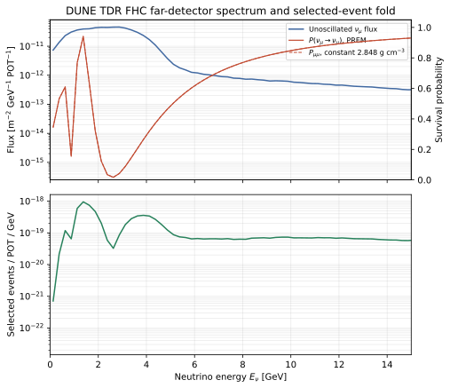
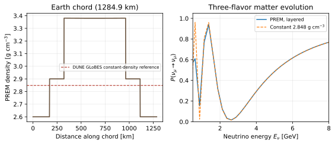
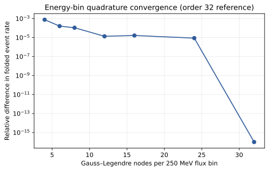
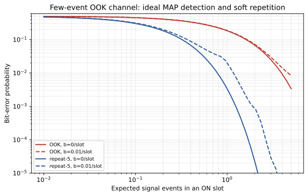
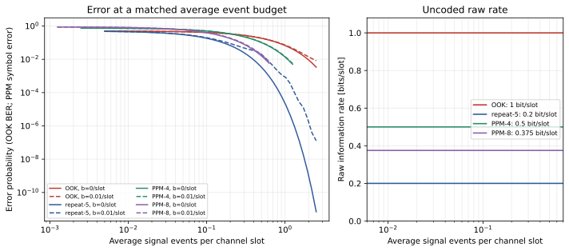
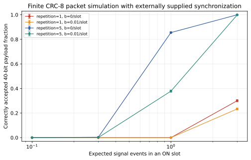
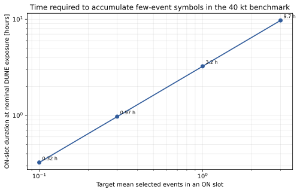

# Paper II: End-to-End Simulation of a Neutrino Communication Channel Through the Earth

*Article draft — version 0.1; results are a reproducible benchmark calculation, not an engineering design.*

## Abstract

We present a DUNE-based source-to-count benchmark and finite-decoder study for a neutrino counting channel. The calculation folds the unoscillated DUNE TDR forward-horn-current (FHC) flux through three-flavor matter evolution along the 1284.9 km GLoBES baseline, charged-current cross sections, and a published DUNE selection-efficiency vector. Twelve-point Gaussian quadrature within the 250 MeV flux bins is checked against orders up to 32. In a 40 kt fiducial-mass benchmark at a nominal exposure of \(1.1\times10^{21}\) protons on target (POT) per year, the conditional fold yields approximately \(2.5\times10^{-18}\) selected \(\nu_\mu\) charged-current events per POT, or about 2700 selected signal events per exposure year. Treating that nominal annual exposure as a calendar-average rate gives approximately \(8.6\times10^{-5}\) events s\(^{-1}\); accumulating 0.1, 0.3, 1, and 3 expected selected events therefore takes approximately 0.32, 0.97, 3.24, and 9.72 h. We evaluate on-off keying (OOK), pulse-position modulation (PPM), repetition-5 soft combining, and finite 40-bit payload plus CRC-8 packets under explicit signal-event budgets. At one expected event per ON slot and zero background, one of 12,000 packet trials with no repetition or forward-error correction succeeds (\(8.3\times10^{-5}\); 95% Wilson interval \(1.5\times10^{-5}\) to \(4.7\times10^{-4}\)); each packet still includes CRC-8. This conditional benchmark omits reconstructed-energy migration, propagated physical uncertainties, spill-resolved live time, operational backgrounds, and synchronization acquisition. The flux-plane to oscillation-baseline mapping also remains unconfirmed; the rate is not a detector prediction.

**Keywords:** neutrino communication; DUNE; Earth matter effects; Poisson channel; finite-block coding; pulse-position modulation.

## 1. Introduction

Neutrinos pass through the Earth with little attenuation, but their weak interaction makes them difficult to receive. A communications claim must therefore connect the source to decoded information: a specified beam produces a spectrum and angular distribution; propagation changes flavor; interactions and detector selection create a sparse event record; and a protocol must turn that record into an accepted message. An assumed event mean is enough to study an abstract Poisson channel, but it does not tell us whether a source and receiver produce that mean.

Our earlier communication manuscript, *Direct Neutrino Communication Through the Earth: NuMI-Calibrated Simulation and Far-Field Sensitivity* [10], separated a NuMI–MINERvA-calibrated packet exercise from an idealized far-field sensitivity calculation. The former used a reported selected-event mean and timing to simulate a new repeated-OOK/CRC protocol; it did not reproduce the experimental decoder. The far-field calculation exposed how strongly performance depends on assumed divergence, survival probability, detector efficiency, and background. Its neutrino-carried power was not accelerator electrical power. Paper II replaces the free long-baseline event-rate input with a public, source-derived flux fold and then passes the resulting sparse-count channel through explicit baseline decoders.

A second related work, *Locating nuclear-powered submarines with antineutrinos* [11], studies passive detection of an uncontrolled reactor-antineutrino source. That work motivates careful treatment of sparse counts and background, but it is a detection problem with a different source, spectrum, geometry, and receiver model. None of its event rates or detector assumptions are transferred here. Earlier theory has considered other regimes; for example, Learned, Pakvasa, and Zee discussed galactic neutrino communication near the Glashow resonance [9]. That high-energy proposal is distinct from accelerator-beam transmission through the Earth. The experimental NuMI–MINERvA demonstration remains a separate proof-of-principle reference: Stancil et al. reported a decoded rate of 0.1 bit s\(^{-1}\) and a 1% bit-error rate over 1.035 km, including 240 m of earth [1].

This paper makes a deliberately limited contribution: it combines a public long-baseline flux input with a propagation and interaction fold, then feeds the resulting conditional event means into baseline sparse-count decoders. Earlier work includes the NuMI communication demonstration, which reported 0.1 bit s\(^{-1}\) and 1% BER for its specific 1.035 km setup [1], alongside sensitivity studies and proposals for longer-baseline neutrino communication [9,10]. Our contribution is a conditional DUNE-input event-rate fold joined to explicit count decoders; it is not a priority claim. A future information-theory paper, *The Neutrino Channel: Capacity and Coding in the Few-Event Regime*, will use the declared channel distributions to investigate constrained capacity, practical codes, and finite-blocklength tradeoffs.

## 2. Benchmark and model

### 2.1 Source and detector reference

The source spectrum is the public DUNE TDR FHC far-detector flux histogram associated with G4LBNF v3r5p4 and the 2017 optimized-engineered beam configuration. Flux entries are in neutrinos \(\mathrm{GeV}^{-1}\,\mathrm{m}^{-2}\,\mathrm{POT}^{-1}\), sampled in 250 MeV bins. We use the associated GENIE charged-current cross-section table, GLoBES configuration, and FHC \(\nu_\mu\)-disappearance selection-efficiency vector [2–5]. The benchmark uses a 40 kt fiducial mass, a 120 GeV proton beam, and \(1.1\times10^{21}\) POT per nominal exposure year [2,6]. DUNE documentation locates the FD histogram plane 1297 km downstream of Horn 1, whereas the GLoBES configuration specifies a 1284.9 km oscillation baseline [2,7]. We retain the supplied, location-specific flux normalization and use the configured baseline for oscillations. We do not apply an inverse-square correction: the histogram is a beamline simulation at a stated plane, not a point-source fluence law. The exact geometric mapping between these file conventions remains to be confirmed against the original beamline coordinates before precision use.

This is a DUNE-like simulation benchmark, not a proposed DUNE communications mode. The public far-detector flux already contains beamline and geometric flux prediction. We do not introduce an independent beam-divergence parameter or rescale that flux as if it were a newly designed transmitter.

### 2.2 Earth propagation

We solve three-flavor Schrödinger evolution through matter. For neutrino energy \(E\), the flavor-basis Hamiltonian in each constant-density segment is

\[
H_f(E,x)=\frac{1}{2E}U\,\mathrm{diag}(0,\Delta m^2_{21},\Delta m^2_{31})U^\dagger
+\mathrm{diag}(V(x),0,0),
\qquad V(x)=\sqrt{2}G_F N_e(x).
\]

The PMNS parameters use the central values configured in the public DUNE GLoBES file (NuFIT 4.0 normal ordering, \(\delta_{CP}=0\) for this benchmark) [2,4]. Density follows the radial PREM profile [8], with electron fraction fixed to 0.50, and the 1284.9 km chord is split into midpoint segments no longer than 5 km. Layer evolution is multiplied in path order. Probability normalization and PMNS unitarity are tested numerically. As an independent numerical-method check, production Hermitian eigendecomposition is compared with segment-by-segment propagation using `scipy.linalg.expm`. This checks the evolution algorithm using the same physical Hamiltonian; it is not a comparison against a separate oscillation-physics package.

### 2.3 Selected event rate

For a detector containing \(N_T\) target nucleons, the selected signal expectation per POT is approximated by

\[
\mu_{\mathrm{sel}}/\mathrm{POT}=N_T\sum_i \Phi_{\nu_\mu,i}\,
\int_{E_i^-}^{E_i^+} dE\,P_{\mu\mu}(E,L)\,
\sigma^{CC}_{\nu_\mu}(E)\,\epsilon(E).
\]

The flux \(\Phi_{\nu_\mu,i}\) is taken constant within its published bin. The integral uses 12-point Gauss–Legendre quadrature in each bin; the 12-point result is compared with orders 4, 6, 8, 16, 24, and 32 in the convergence table and figure. The cross section is interpolated from the GENIE table [5]. We apply the published selection-efficiency vector directly against true energy as a first-order proxy. In the released GLoBES configuration that vector belongs to a reconstructed-energy response; applying it without the full migration matrix can bias the selected rate and is likely the largest avoidable detector-model limitation in this first pass.

The signal model includes only selected \(\nu_\mu\) charged-current events. Neutral-current interactions, other flavors, cosmic activity, detector-specific accidental events, correlated systematic uncertainty, and selection migrations are not included. Background means of 0 and 0.01 events per slot are fixed channel-law sensitivity cases, not DUNE predictions or fixed physical background rates. Because the slot duration changes with the signal mean in the DUNE scale illustration, a constant per-slot background corresponds to different rates per unit time across operating points.

### 2.4 Symbol and packet model

For binary OOK, the OFF and ON counts are Poisson with means \(b\) and \(b+s\), where \(s\) is the selected signal mean in an ON slot and \(b\) is the background mean per slot. For equiprobable symbols the MAP detector is a count threshold selected from the Poisson likelihood ratio. We report its false-alarm probability, miss probability, and bit-error probability. Repetition-5 uses five slots per payload bit and combines counts before applying the MAP threshold. Capacity in the data files is the maximum mutual information for binary OOK over input probability \(0\le p_{\mathrm{on}}\le0.5\); it is a binary-input, memoryless-channel benchmark, not a system throughput result.

For PPM of order \(M\), one of \(M\) slots is ON and the largest observed count selects the symbol; ties are randomized. The exact symbol-error calculation assumes independent Poisson counts and known symbol timing. Schemes are compared at a matched mean signal-event budget \(q\) per channel slot. Equiprobable OOK has one raw bit per slot and \(q=s/2\), where \(s\) is the conditional ON-slot mean. Repetition-5 has 0.2 raw bits per slot and spends \(5q\) mean events per raw bit. M-PPM sends one ON slot per \(M\)-slot symbol, giving \(q=s/M\), \(\log_2(M)/M\) raw bits per slot, and \(s/\log_2(M)\) mean signal events per raw bit. We convert the selected-event budget to an incident-proton beam-energy equivalent using the folded selected events/POT and the 120 GeV proton energy. This is not neutrino-carried energy, facility electrical energy, or a full accelerator cost model. OOK BER and PPM symbol-error probability are different metrics and are labelled separately.

The finite packet simulation sends a random 40-bit payload followed by CRC-8/ATM in 48 OOK bits, with optional repetition-5. It uses 12,000 Monte Carlo packets per operating point and a fixed seed. Slot synchronization is supplied externally; acquisition, acknowledgement, retransmission, and synchronization loss are not simulated. Wilson intervals are reported for packet success. CRC acceptance and undetected wrong payloads are counted separately, since a CRC is an error detector rather than a guarantee of correctness.

### 2.5 Exposure, latency, and energy boundary

For scale estimates, the nominal annual POT is divided by calendar seconds. An expected signal mean \(s\) then corresponds to slot duration \(T_s=s/R_{\mathrm{sel}}\). This uses the published annual exposure convention, which incorporates projected accelerator availability; we do not apply a second uptime factor. It is not a spill-level timing simulation and contains no explicit bunch structure, live-time gate, or modulation window. Packet latency multiplies this slot duration by the number of encoded slots. Proton beam energy is tallied separately where shown, using 120 GeV per proton and expected POT. Accelerator wall-plug energy, target and focusing losses, and facility overhead are not estimated.

## 3. Numerical results

### 3.1 Source fold and propagation

The PREM chord has a path-average density of 3.059 g cm\(^{-3}\); the public GLoBES configuration uses a constant 2.848 g cm\(^{-3}\) reference. With the true-energy efficiency proxy, the conditional PREM fold gives about \(2.5\times10^{-18}\) selected \(\nu_\mu\) CC events/POT in 40 kt. The constant-density version of the same model gives a similar rate; the two numerical outputs differ by 0.08% for this integrated observable. This comparison is internal to the same rate-fold implementation and does not characterize total model accuracy; the efficiency proxy and omitted migration dominate the interpretation.

At \(1.1\times10^{21}\) POT per nominal exposure year, the result is about 2700 selected events per year, or \(8.6\times10^{-5}\) events per calendar second. The input spectrum, bin-averaged survival probability, and selected contribution by energy are shown in Fig. 1. Figure 2 shows the PREM chord and compares its oscillation calculation with a constant-density approximation.



*Figure 1. Public DUNE TDR flux and the first-order selected \(\nu_\mu\) CC fold. The bottom panel is the bin-integrated contribution divided by the 250 MeV bin width. The true-energy efficiency proxy is not a full detector migration model.*



*Figure 2. The 1284.9 km chord and three-flavor matter survival probability for the benchmark. The path-averaged PREM density differs from the constant-density GLoBES reference.*

The energy-bin integration was checked by increasing the Gauss–Legendre order while holding the remaining inputs fixed. Relative to the 32-node rate, order 12 differs by \(1.36\times10^{-5}\); the largest difference in the tested orders 4–32 is \(7.65\times10^{-4}\) at order 4. The sequence is not strictly monotonic, so we report the values rather than infer a monotone error law. The rate is also stable against PREM segment size: the 10, 5, and 2 km results differ from the 1 km result by less than \(10^{-10}\) relative.

| Gauss–Legendre nodes/bin | Relative rate difference from 32-node value |
|---:|---:|
| 4 | \(7.65\times10^{-4}\) |
| 6 | \(1.61\times10^{-4}\) |
| 8 | \(1.09\times10^{-4}\) |
| 12 | \(1.36\times10^{-5}\) |
| 16 | \(1.66\times10^{-5}\) |
| 24 | \(8.82\times10^{-6}\) |
| 32 | reference |

An independent numerical-method check compared the eigensolver with scipy.linalg.expm segment evolution at seven energies from 0.5 to 8 GeV. For both constant-density and PREM paths, the maximum absolute difference among the nine transition probabilities was \(1.2\times10^{-13}\). This supports the numerical matrix-evolution implementation; it does not independently validate oscillation inputs, flux, cross sections, or detector response against a GLoBES run.



*Figure 3. Relative variation in the integrated rate as per-bin quadrature order increases. Order 32 is a numerical reference, not an exact result.*

### 3.2 Few-event symbols and finite packets

At an expected 0.1 selected signal events per ON slot, ideal equiprobable OOK with zero background has a BER of 0.452; at one event per ON slot, the BER is 0.184. A background mean of 0.01 events per slot changes the MAP threshold as the signal-to-background ratio changes. Repetition-5 reduces bit errors at a fixed per-slot mean by accumulating five times as much exposure, while reducing raw payload rate by the same factor before framing overhead. Figure 4 compares those ideal OOK and repetition results.



*Figure 4. Exact Poisson MAP BER for OOK and count-combined repetition-5, for two assumed per-slot background sensitivities. These curves omit synchronization, framing, and retransmission.*

PPM is compared at the same average selected-signal event budget per channel slot, \(q\), as OOK. For example, at \(q=0.1\) and zero background, the conditional ON-slot means are 0.2 for OOK, 0.4 for PPM-4, and 0.8 for PPM-8. This equalizes mean signal events per slot, but the error metrics differ (OOK bit error versus PPM symbol error). PPM also trades raw rate for symbol reliability: it carries \(\log_2(M)/M\) raw bits per slot, compared with 1 for equiprobable OOK and 0.2 for repetition-5.

| Scheme | Raw bits/slot | Mean signal events/raw bit at \(q=0.1\) | Conditional incident-proton primary-beam energy equivalent/raw bit (not system energy) | Error metric | Error probability, \(b=0\) |
|---|---:|---:|---:|---|---:|
| OOK | 1.000 | 0.100 | \(7.82\times10^8\) J | bit error | 0.4094 |
| repetition-5 | 0.200 | 0.500 | \(3.91\times10^9\) J | bit error | 0.1839 |
| PPM-4 | 0.500 | 0.200 | \(1.56\times10^9\) J | symbol error | 0.5027 |
| PPM-8 | 0.375 | 0.267 | \(2.09\times10^9\) J | symbol error | 0.3932 |

The energy column converts the selected-event budget through the modeled events/POT and 120 GeV incident-proton energy. It is a conditional on-target beam-energy equivalent per raw bit, not the energy consumed by an operational communication system or receiver.

At the larger matched budget \(q=0.5\), PPM-4 and PPM-8 have symbol-error probabilities 0.1015 and 0.0160, respectively, with raw rates 0.5 and 0.375 bit/slot. The complete comparison at \(q=0.1,0.25,0.5\) and both background sensitivities is in equal_event_budget_comparison.csv. Figure 5 shows error metrics and raw rate on the matched per-slot event-budget axis. This uncoded comparison does not account for symbol synchronization, framing, coding overhead, or equalized physical detector-background rates.



*Figure 5. Left: OOK bit-error probability and PPM symbol-error probability, labelled separately, against average selected signal events per slot. Right: uncoded raw bits per slot. The event budget is an exposure proxy, not an absolute energy measurement.*

The finite packet experiment makes the framing cost visible. At one expected signal event per ON slot and zero background, one of 12,000 packet trials with no repetition or forward-error correction succeeds (CRC-8 is still appended): \(8.3\times10^{-5}\), with a 95% Wilson interval \([1.5\times10^{-5},4.7\times10^{-4}]\). The interval is broad because this is one observed success. Repetition-5 gives a 0.855 success fraction at that operating point. With repetition-5 at three events per ON slot and zero background, all 12,000 packets decode correctly; the 95% Wilson lower bound is about 0.99968, not 1. At one event per slot, the 48-bit frame takes about 155.5 h without repetition and 777.7 h with repetition under the calendar-average exposure conversion. These are simulation outcomes under externally supplied timing and the stated rate model, not measured communications performance.

At a 0.01 event-per-slot background, success is lower at the same signal mean. CRC acceptance is nonzero even when no complete payload is correct; the CRC therefore cannot be interpreted as a message-delivery guarantee. Figure 6 and `finite_crc_packet_simulation.csv` report correct packet acceptance, CRC acceptance, and undetected wrong payload outcomes for every simulated operating point.



*Figure 6. Correctly accepted 40-bit payload fraction from 12,000 packet trials per point; vertical bars are 95% Wilson intervals. The right panel uses a logarithmic probability scale to expose rare outcomes; zero-success points are plotted at \(0.5/N\) for display and are not nonzero estimates. Synchronization is assumed available.*

The event-rate conversion puts the sparse-symbol regime on an operational timescale: 0.1 selected signal events require about 0.324 h, 0.3 events 0.972 h, one event 3.24 h, and three events 9.72 h of nominal exposure. These intervals are per ON slot; an OFF slot and the remaining frame slots add wall-clock time. Figure 7 summarizes the signal accumulation scale.



*Figure 7. Calendar-average slot duration required to accumulate the indicated selected signal mean. The nominal annual POT includes the published projected-availability convention, but spill structure and usable live-time windows are not modeled explicitly.*

## 4. Discussion

The main result is methodological: under the stated assumptions, the conditional DUNE-input fold yields about \(2.5\times10^{-18}\) selected \(\nu_\mu\) CC events/POT, or about 2700 events per nominal exposure year for a 40 kt fiducial receiver. This is not a detector prediction: the reconstructed-energy efficiency is used as a true-energy proxy, physical input uncertainties are not propagated, and the flux-plane/baseline coordinate mapping remains unconfirmed. At the resulting calendar-average rate, a single binary slot with a sub-event mean lasts tens of minutes to hours. Framing multiplies that duration by dozens of encoded bits, and repetition improves reliability only by consuming additional slots. PPM can improve symbol discrimination when the event budget is concentrated in one of several slots, but pays in raw bits/slot and requires symbol timing. These uncoded results do not replace a capacity analysis or practical synchronization protocol.

The numerical result is not a direct prediction of a functioning communication link. The source flux is a far-detector simulation for an oscillation experiment, and the detector response is simplified by using a reconstructed-energy efficiency against true energy. Most importantly for a real decoder, no spill-resolved source schedule, beam-on/beam-off background model, or clock-acquisition procedure has been propagated into the packet simulation. Although nominal annual POT incorporates projected accelerator availability, the model contains no explicit spill timing or live-time window; those determine whether symbols of the estimated duration could actually be scheduled. A different source, spectrum, receiver geometry, or coded modulation would define a different benchmark and must be modeled explicitly.

The full migration matrix is the next necessary physics improvement. After that, the model should use spill-level flux and detector live-time, include measured beam-on and beam-off backgrounds, and propagate flux, cross-section, oscillation, and selection uncertainties. A synchronization and packet protocol can then be tested against event timestamps. The SciPy matrix-exponential check verifies a second numerical route to the same Hamiltonian evolution; direct comparison with a GLoBES probability or event-rate run remains a useful next validation. Facility-input energy requires an independently specified accelerator operating point and cannot be inferred from neutrino-carried energy or POT alone. These improvements are prerequisites before interpreting the outputs as achievable throughput or energy per delivered bit.

Paper I and the present article remain complementary: Paper I records the NuMI-calibrated communication demonstration context and a separate idealized sensitivity exercise; Paper II derives a source-based event rate and sends sparse counts through explicit baseline decoders. The passive submarine antineutrino study remains methodologically related only through low-count inference. The capacity-and-coding follow-on should inherit the channel law and input constraints produced here while studying the coding problem in more depth.

## 5. Conclusion

We implemented and tested a reproducible DUNE TDR-based source-to-count model and a finite-message Poisson decoder baseline. Under the stated assumptions, the conditional fold gives about \(2.5\times10^{-18}\) selected \(\nu_\mu\) CC signal events/POT, or about 2700 events per 40 kt nominal exposure-year. This is a source-to-count benchmark, not a detector prediction: the reconstructed-energy efficiency is used as a true-energy proxy, physical input uncertainties are not propagated, the flux-plane/baseline mapping is unconfirmed, and a direct GLoBES probability or rate comparison remains outstanding. The packet simulations include CRC-8 but no repetition in the low-success reference case; repetition-5 improves reliability at the cost of more channel uses. Synchronization acquisition, spill timing, realistic backgrounds, retransmission, and accelerator electrical energy remain outside the model.

## Data and code availability

The analysis is in `communication/paper_ii/analysis/`; public DUNE inputs and their provenance are in `communication/paper_ii/data/inputs/`; generated CSV and JSON outputs are in `communication/paper_ii/data/simulation/`; and vector figures are in `communication/paper_ii/figures/`. Reproduce with:

```bash
python -m pip install -r communication/paper_ii/analysis/requirements.txt
python communication/paper_ii/analysis/run_simulation.py
python -m unittest discover -s communication/paper_ii/analysis -p 'test_*.py'
```

## References

1. D. D. Stancil et al., “Demonstration of Communication using Neutrinos,” *Modern Physics Letters A* **27**, 1250077 (2012), [arXiv:1203.2847](https://arxiv.org/abs/1203.2847).
2. DUNE Collaboration, “Experiment Simulation Configurations Approximating DUNE TDR,” arXiv:2103.04797 (2021), [doi:10.48550/arXiv.2103.04797](https://doi.org/10.48550/arXiv.2103.04797). Includes public simulated flux and GLoBES ancillary inputs.
3. P. Huber, M. Lindner, and W. Winter, “Simulation of long-baseline neutrino oscillation experiments with GLoBES,” *Computer Physics Communications* **167**, 195–202 (2005), [doi:10.1016/j.cpc.2005.01.003](https://doi.org/10.1016/j.cpc.2005.01.003).
4. I. Esteban et al., “The fate of hints: updated global analysis of three-flavor neutrino oscillations,” *Journal of High Energy Physics* **09**, 178 (2020), [arXiv:2007.14792](https://arxiv.org/abs/2007.14792).
5. C. Andreopoulos et al., “The GENIE Neutrino Monte Carlo Generator,” *Nuclear Instruments and Methods in Physics Research A* **614**, 87–104 (2010), [doi:10.1016/j.nima.2009.12.009](https://doi.org/10.1016/j.nima.2009.12.009).
6. DUNE Collaboration, [DUNE Fluxes: beam and flux documentation](https://glaucus.crc.nd.edu/DUNEFluxes/), specifying the 120 GeV, \(1.1\times10^{21}\) POT/year, 1.2 MW reference scenario and flux-file format.
7. DUNE Collaboration, “Deep Underground Neutrino Experiment (DUNE), Far Detector Technical Design Report, Volume II: DUNE Physics,” arXiv:2002.03005 (2020), [arXiv record](https://arxiv.org/abs/2002.03005).
8. A. M. Dziewonski and D. L. Anderson, “Preliminary reference Earth model,” *Physics of the Earth and Planetary Interiors* **25**, 297–356 (1981), [doi:10.1016/0031-9201(81)90046-7](https://doi.org/10.1016/0031-9201(81)90046-7).
9. J. G. Learned, S. Pakvasa, and A. Zee, “Galactic Neutrino Communication,” arXiv:0805.2429 (2008), [arXiv record](https://arxiv.org/abs/0805.2429).
10. S.-P. Hallsjö, “Direct Neutrino Communication Through the Earth: NuMI-Calibrated Simulation and Far-Field Sensitivity,” Paper I, repository manuscript (updated September 2026; no stable arXiv identifier yet), [communication manuscript folder](https://github.com/patha325/neutrinoArticles/tree/paper-ii/end-to-end-channel/communication/manuscript).
11. S.-P. Hallsjö, “Locating nuclear-powered submarines with antineutrinos,” arXiv:2605.15642 (2026), [arXiv record](https://arxiv.org/abs/2605.15642).
